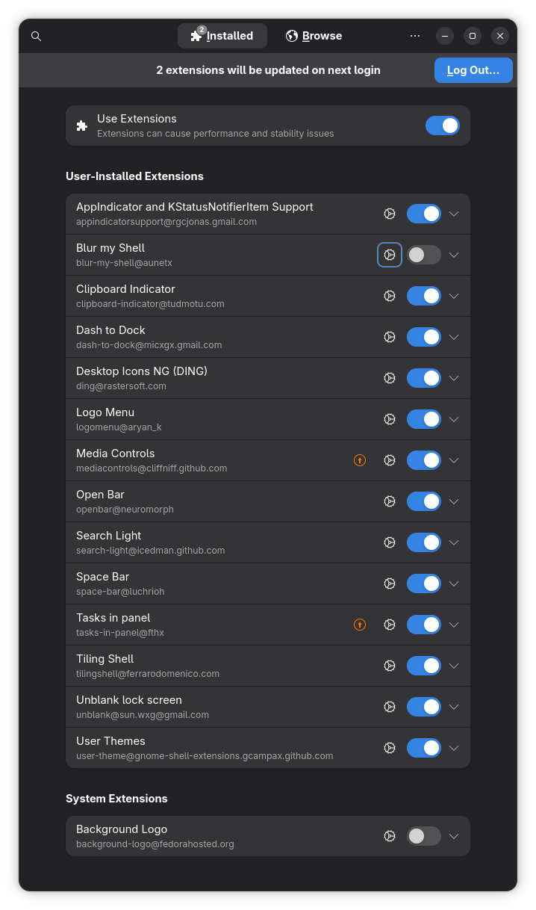

# Dotfiles

Fedora odakli, paylasima uygun kisisel desktop config paketi.



## Icerik

- `gnome-extensions/enabled-extensions.txt`: Aktif edilmesi istenen GNOME extension UUID listesi
- `gnome-extensions/extensions-settings.dconf`: GNOME extension ayarlari (local path satirlari sanitize edildi)
- `gnome-extensions/extensions/`: Export edilen extension dosyalari
- `starship.toml`: Starship prompt config
- `scripts/install-gnome.sh`: Agent-friendly, idempotent kurulum scripti

## Dependency (GNOME yolu)

Gerekli komutlar:

- `gnome-extensions`
- `dconf`
- `gsettings`
- `rsync`
- `starship` (opsiyonel, prompt istiyorsan)

Kontrol/yonetim araci (onerilen):

- `gnome-tweaks`
- `gnome-extension-manager`
- Nobara icin: `nobara-sync` (resmi update akisi)

Fedora icin ornek:

```bash
sudo dnf install -y gnome-extensions-app dconf rsync starship gnome-tweaks gnome-extension-manager
```

## Preflight Kontrolleri (GNOME/KDE/Nobara)

```bash
# Desktop tespiti
echo "XDG_CURRENT_DESKTOP=$XDG_CURRENT_DESKTOP"
echo "DESKTOP_SESSION=$DESKTOP_SESSION"

# GNOME araclari
command -v gnome-extensions
command -v gnome-tweaks
command -v gnome-extension-manager

# KDE araclari (KDE kullaniyorsan)
command -v kpackagetool6 || command -v kpackagetool5

# Nobara updater (Nobara kullaniyorsan)
command -v nobara-sync
```

## Agent-Friendly Kurulum

Repo klasorunde:

```bash
bash scripts/install-gnome.sh
```

Onay sorusu olmadan calistirmak istersen:

```bash
bash scripts/install-gnome.sh --yes
```

Sadece kontrol/dry-run:

```bash
bash scripts/install-gnome.sh --dry-run
```

Ne yapar:

1. Dependency kontrolu yapar
2. Extension dosyalarini `~/.local/share/gnome-shell/extensions/` altina senkronlar
3. `extensions-settings.dconf` dosyasini yukler
4. `enabled-extensions.txt` listesindeki extensionlari enable etmeye calisir
5. `starship.toml` dosyasini `~/.config/starship.toml` altina kopyalar

Not:

- GNOME Shell restart/islem yenilemesini kendin yap: Wayland'de logout/login, X11'de `Alt+F2` sonra `r`.
- `blur-my-shell` bu repoda bilerek kapali tutuluyor (enabled listede yok).
- Neden: `blur-my-shell` ozellikle pencere/background blur efektlerinde sistemi ciddi sekilde yorabiliyor; CPU/GPU yukunu arttirip takilma ve animasyon gecikmesi yaratabiliyor.
- Acmak istersen: `gnome-extensions enable blur-my-shell@aunetx`

## Manuel Kurulum

```bash
mkdir -p ~/.local/share/gnome-shell/extensions ~/.config
rsync -a --delete gnome-extensions/extensions/ ~/.local/share/gnome-shell/extensions/
dconf load /org/gnome/shell/extensions/ < gnome-extensions/extensions-settings.dconf
while read -r ext; do
  [ -n "$ext" ] && gnome-extensions enable "$ext" || true
done < gnome-extensions/enabled-extensions.txt
cp starship.toml ~/.config/starship.toml
```

## Nobara Linux Tavsiyeleri (2026-02-21 dogrulandi)

Nobara tarafinda GNOME extension varsayimi surume gore degisebilir. Bu nedenle once mevcut durumu denetleyip sonra bu repo ayarlarini uygulamak daha guvenli.

2026 odakli kisa bulgular:

1. Resmi indirme sayfasinda `Nobara-43` ISO'lari gorunuyor (`GNOME`, `KDE`, `Official`, `Steam`) ve dosya tarihleri `2026-01-25/26/27`.
2. Resmi FAQ'da `Official` surumun "modified KDE layout" oldugu, GNOME ve KDE'nin ayrica sunuldugu belirtiliyor.
3. Resmi `nobara-images` repo kickstart dosyalarinda guncel GNOME image'larda (N42/N43) acikca gorunen extension paketi pratikte `gnome-shell-extension-gamemode`.
4. N42 kickstart'ta `-gnome-shell-extension-background-logo` satiri var (kaldirma), ek "varsayilan extension listesi" olarak yorumlanmamali.

Nobara update/upgrade politikasi (resmi):

1. Wiki `update-system` sayfasi: `dnf update` tek basina yeterli degil, `Update System` akisi oneriliyor.
2. Wiki `upgrade-nobara` sayfasi: `dnf-plugin-system-upgrade` yontemi icin acikca `DON'T USE THESE` uyarisi var.
3. CLI tarafinda `nobara-sync` ve `nobara-sync cli` akisi var.

Nobara GNOME'da bu repo'yu uygulamadan once:

```bash
# Aktif extensionlar
gnome-extensions list --enabled

# Kurulu extension paketleri
rpm -qa | sort | rg '^gnome-shell-extension'

# Dconf yedegi (rollback icin)
dconf dump /org/gnome/shell/extensions/ > ~/extensions-backup-nobara.dconf
```

Not:

- Bu repo `blur-my-shell` kapali yaklasimini korur; performans nedeniyle Nobara'da da varsayilan olarak kapali tutman tavsiye edilir.
- Nobara KDE kullaniyorsan alttaki KDE bolumu dogrudan daha uygun.
- Detayli 2026 arastirma notu: `docs/nobara-research-2026.md`

## Theme Snapshot (Guncel)

- Icon theme: `WhiteSur`
- GTK theme: `Tahoe-Dark`
- Cursor theme: `MacTahoe-cursors`

## Icon Theme Degistirme

GNOME:

```bash
# Mevcut icon theme
gsettings get org.gnome.desktop.interface icon-theme

# Icon theme degistir
gsettings set org.gnome.desktop.interface icon-theme 'WhiteSur'
```

KDE/Plasma:

```bash
# Paket arama ornegi (Fedora)
dnf search icon-theme | head

# Uygulama yolu:
# System Settings -> Appearance -> Icons
```

Tavsiye:

1. Icon paketini `~/.icons` veya `~/.local/share/icons` altina kur.
2. GNOME'da `gsettings` veya `gnome-tweaks` ile sec.
3. KDE'de System Settings uzerinden secip oturum yenile.
4. Paylasimda lisansi acik olan icon paketlerini tercih et.

## KDE Kullananlar Icin Alternatif Yol

Bu repo GNOME tabanli. KDE/Plasma kullaniyorsan birebir calismaz. Arastirma icin tavsiye edilen eslestirme:

1. Dock/Panel: GNOME `dash-to-dock` yerine Plasma panel + Icons-only Task Manager
2. Blur/Glass etkisi: GNOME `blur-my-shell` yerine KWin blur/desktop effects + tema motoru (Kvantum)
3. Media kontrolleri: GNOME `mediacontrols` yerine Plasma widgetlar (Media Controller)
4. Workspace/tiling: GNOME `tilingshell/forge` yerine KWin scripts (tiling)
5. Top bar gorunumu: GNOME `openbar` yerine Plasma panel temasi + renk ayarlari

Arastirma baslangic komutlari:

```bash
# Kurulu Plasma paketleri
dnf list installed | rg -i 'plasma|kwin|kde'

# KWin scriptleri / plasmoid paketleri (sistemine gore biri bulunur)
command -v kpackagetool6 && kpackagetool6 --list --type KWin/Script
command -v kpackagetool5 && kpackagetool5 --list --type KWin/Script
```

Arastirma anahtar kelimeleri:

- `plasma panel transparency blur`
- `kwin tiling script fedora`
- `plasma media controller widget`
- `kvantum fedora setup`

## Arastirma Kaynaklari

- Nobara download sayfasi (Nobara 43 ISO listesi): `https://nobaraproject.org/download-nobara/`
- Nobara Wiki FAQ (Official/GNOME/KDE aciklamasi): `https://wiki.nobaraproject.org/FAQ/FAQ`
- Nobara Wiki Update System: `https://wiki.nobaraproject.org/general-usage/troubleshooting/update-system`
- Nobara Wiki Upgrade Nobara: `https://wiki.nobaraproject.org/general-usage/troubleshooting/upgrade-nobara`
- Nobara Wiki New User Guide (general guidelines): `https://wiki.nobaraproject.org/en/new-user-guide-general-guidelines`
- Nobara images (official kickstarts): `https://github.com/Nobara-Project/nobara-images`
- N43 GNOME kickstart (line 430): `https://raw.githubusercontent.com/Nobara-Project/nobara-images/main/ISO-ready-flattened-kickstarts/43/flat-nobara-live-gnome-43.ks`
- N43 GNOME NV kickstart (line 441): `https://raw.githubusercontent.com/Nobara-Project/nobara-images/main/ISO-ready-flattened-kickstarts/43/nv-flat-nobara-live-gnome-43.ks`
